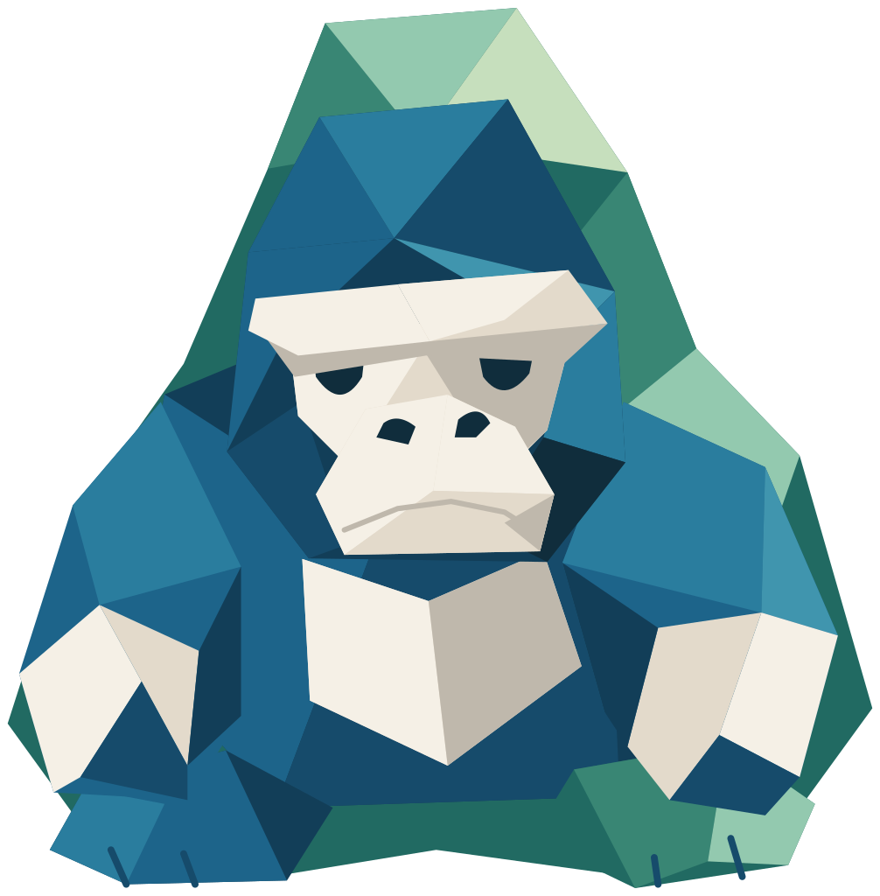

# Origori — standalone vector assets

元のオリゴリの青・青緑・白い眉と腕、折り紙の面を引き継ぎ、アイコンとして描き起こした素材です。紙の細かなテクスチャは省き、形と表情が小サイズでも残るよう整理しています。

| 名前 | SVG | 透過PNG |
| --- | --- | --- |
| たつ | [origori-standing.svg](origori-standing.svg) | [1020×1024](origori-standing.png) |
| すわる | [origori-sitting.svg](origori-sitting.svg) | [1006×1024](origori-sitting.png) |
| ひらめき | [origori-idea.svg](origori-idea.svg) | [1024×1015](origori-idea.png) |
| ひとやすみ | [origori-resting.svg](origori-resting.svg) | [1024×633](origori-resting.png) |
| かみひこうき | [origori-plane.svg](origori-plane.svg) | [1024×812](origori-plane.png) |
| かお | [origori-face.svg](origori-face.svg) | [886×1024](origori-face.png) |
| くしゃくしゃ | [origori-crumpled.svg](origori-crumpled.svg) | [1005×1024](origori-crumpled.png) |

SVGはパス・ポリゴン・円のみで構成。外部ファイル、埋め込み画像、CSSへの依存はありません。PNGはSVGから書き出したRGBA画像です。どちらも背景を持たず、周囲の余白は約1〜2%です。

ウェブではSVGをそのまま使えます。背景を透過するためのCSSや切り取り処理は不要です。

```html

```

全身ポーズは48px以上、24px程度の小さな用途には顔の素材が見分けやすくなります。PNGはSVGに対応していないアプリへの貼り付け用です。

編集用マスター: `../../build-mascots.mjs`。元ファイルを変更後、プロジェクトのルートから次を実行します。

```sh
node dev-pages/origori/build-mascots.mjs
node dev-pages/origori/verify-mascots.mjs
```

## 動くオリゴリ

- [紙飛行機になって飛ぶGIF](origori-fold-and-fly.gif): 512×512px、52フレーム、2.6秒。
- [くしゃくしゃから復元するGIF](origori-crumple-and-unfold.gif): 512×512px、56フレーム、2.8秒。
- [とことこ歩くGIF](origori-walking.gif): 512×512px、32フレーム、1.6秒。[静止ポスターSVG](origori-walking.svg)もあります。

透過背景・20fps・無限ループです。GIFは二値の透過、PNGは半透明の輪郭も持ちます。静止画と同じSVGの面を動かして作成しています。サイト上の再生は任意で、停止ボタンがあります。

SVG変更後は`../../build-motion.mjs`で変形データを再生成し、`../../build-gifs.mjs`でGIFを書き出します。サイト内の変形は`../../origori-motion.tsx`から使えます。小さなアイコンにGIFを縮小すると折り面が見えづらいため、ウェブにはSVGを推奨します。

歩行の編集用マスターは`../../walking-geometry.mjs`です。4本の手足を交互に動かす横向きの姿で、`../../build-gifs.mjs`からGIFと静止SVGを書き出せます。スクロールに反応するサイト内の歩行にも、同じ折り面を使用しています。
