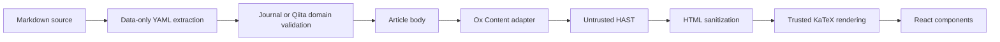

# Article content pipeline

Journal and Qiita use the same `MarkdownArticle` presentation component and the
same content compiler. Ox Content is pinned to `@ox-content/wasm` **3.1.1**.

## Boundaries

- `lib/content/frontmatter.mjs`: `readFrontMatter(source)` returns `data`,
  `content`, and `hasFrontmatter`. It supports data-only YAML, including arrays,
  multiline strings, booleans, and dates represented as strings. Duplicate keys,
  invalid YAML, executable tags, and non-object headers fail without echoing
  manuscript content. Journal's allowed fields and publication rules stay in
  `scripts/journal/schema.mjs`; Qiita's explicit public flags stay in its sync script.
- `lib/content/ox-content.mjs`: the only module that calls Ox Content. It consumes
  WASM options, validates parser results, and converts engine-specific math
  markup to standard HAST math nodes. Its `parseMarkdown(source)` result remains
  untrusted and is internal to the compiler.
- `lib/content/markdown.mjs`: `compileMarkdown(body)` returns sanitized HAST with
  KaTeX already rendered. This is the application-facing body compilation API.
  No Ox Content options, classes, or private AST types reach presentation code.
- `components/markdown-article.tsx`: maps HAST to React elements. It owns link and
  image presentation, filename labels, and the existing Mermaid component.
  It never inserts the engine's raw HTML using `dangerouslySetInnerHTML`.
- `lib/content/qiita.mjs`: preserves the existing literal-currency normalization
  without changing fenced or inline code. Source-specific conventions stay out
  of the parser backend.

The adapter is a direct module boundary. Replacing the engine means implementing
the same Markdown-to-HAST contract and passing the content tests; it does not
require changes to article pages, domain validation, or storage. There is no
runtime backend registry or silent fallback to a second Markdown parser.

## Runtime and upstream limitations

The package import `#content-wasm` selects a small loader for Node, Workers, or
the standalone browser workshop. Node reads the pinned package's WASM binary;
Workers import the compiled WASM module; the workshop loads its bundled asset
once with its article chunk. Vinext prerenders the Worker bundle in Node, so the
Worker loader detects that environment and uses the Node loader for that step.
Production article parsing happens on the server. The browser's main site bundle
does not need the Markdown engine.

The [official Node API](https://github.com/ubugeeei-prod/ox-content/tree/main/crates/ox_content_napi)
supports mdast, but the published **3.1.1 WASM API exposes only HTML conversion**.
We use HAST as the common boundary, not an invented mdast-compatible result.
Existing remark/mdast transforms cannot be passed to this WASM adapter. If such
transforms become necessary, replace or extend the adapter when an appropriate
runtime API exists; keep the sanitizer and presentation contract intact.

The [WASM Front Matter implementation](https://github.com/ubugeeei-prod/ox-content/blob/main/crates/ox_content_wasm/src/frontmatter.rs)
is not a full YAML parser: arrays become strings and duplicate keys are accepted.
Therefore, the shared metadata stage intentionally retains `js-yaml` with
`JSON_SCHEMA`; it does not call Ox Content's `transform` for publication metadata.

## Security and compatibility

- GFM tables, task lists, strikethrough, autolinks, footnotes, reference links,
  code fences with filenames, and Japanese text are covered by contract tests.
- Raw HTML is parsed and sanitized before KaTeX. Script/event attributes,
  dangerous URL schemes, iframes, and executable MDX are not enabled.
- DOM-clobber protection keeps IDs prefixed. Heading and footnote links are
  adjusted to the resulting IDs rather than disabling that protection.
- KaTeX runs with `trust: false`, bounded expansion and size, and no console
  warnings that could disclose private text. Math state is not shared between
  articles. Mermaid keeps its existing strict security settings.
- Journal uploads still require the exact owner Access JWT. Original source,
  immutable revisions, D1 records, visibility rules, and no-store responses are
  unchanged. Existing entries render with the new compiler without a migration.

## Verification and performance

Run `npm run test:content`, `npm run test:journal`, `npm run build`, and
`npm run test:journal:browser`. The browser check uses the actual built Worker and
local D1, including upload, immutable source, publication, math, Mermaid, tables,
footnotes, raw HTML, and authorization boundaries. `npm run test:content:browser` checks all 19 Qiita article pages, Mermaid,
hydration, and mobile layout. `npm run build:workshop` checks
the separate browser loader. CI runs the content contract tests on every PR.

`npm run benchmark:content` measures Markdown → sanitization → KaTeX → React
static markup over the generated Qiita articles. It excludes engine startup,
file/network I/O, and UI wrappers, and reports the median of 15 warm runs.

A local comparison on Node 24.13.0 with 19 articles (226,460 bytes after currency
normalization), alternating the previous and new pipelines, measured **61.34 ms
→ 22.98 ms** per corpus (approximately **2.67×** throughput). The previous
pipeline used React Markdown, remark-gfm/math, rehype-raw/sanitize, and KaTeX.
This is a local warm-pipeline measurement, not a claim about production latency
or cold starts. Re-run the benchmark when updating the pinned engine version.
