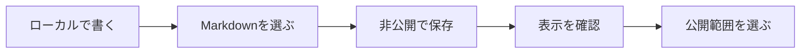

## これは表示確認用のサンプルです

このページは、ローカル環境でJournalの文章や図の表示を確認するためのサンプルです。実際に行った実験の結果を示すものではありません。

## 問いを残す

開発の途中では、すぐに答えが出ない問いが生まれます。

- なぜ、この設計を選んだのか。
- 何を確かめるために、この実験をしたのか。
- うまくいかなかった条件は何だったのか。

その時点の言葉で記録し、後の考察は新しい記録としてつなげていきます。

> 記録したことと、公開することは別の判断です。

## 原稿を保存する流れ



アップロードした原稿は保存版を正本とし、ローカルの原稿は編集しません。公開範囲は後から変更できます。

| 公開範囲 | 読める人 | 公開一覧 |
| --- | --- | --- |
| 非公開 | 管理者本人 | 掲載しない |
| 限定公開 | 共有リンクを持つ人 | 掲載しない |
| 公開 | 誰でも | 掲載する |

## 小さなコードも添える

```ts:journal-example.ts
const record = {
  question: '何を確かめたかったのか',
  observation: '実際に観察できたこと',
  nextQuestion: '次に考えたいこと',
};
```

数式も記述できます。例えば、観測値の平均は $\bar{x} = \frac{1}{n}\sum_{i=1}^{n}x_i$ と表せます。

## 次に試すこと

- [ ] 管理画面から自分のMarkdownをアップロードする。
- [ ] 保存された原稿の表示を確認する。
- [ ] 非公開・限定公開・公開を切り替えてみる。

[Journal一覧に戻る](/journal)
